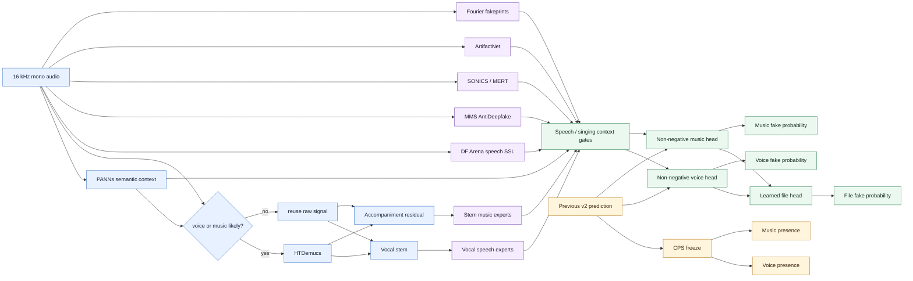

# Multi-component Audio Deepfake Detection

> DACON **딥보이스 범죄 대응을 위한 AI 탐지 모델 경진대회**에서 음성·음악이 섞인 오디오의 진위와 성분 존재를 함께 판별하기 위해 설계한 연구 파이프라인입니다.

[](https://www.python.org/)
[](https://pytorch.org/)
[](https://dacon.io/competitions/official/236749/overview/description)

이 저장소는 최종 제출 ZIP이나 학습 음원을 배포하지 않습니다. 대신 실제 제출물에서 사용한 핵심 설계, 학습·검증 프로토콜, 주석이 포함된 핵심 구현을 공개합니다. 외부 모델 가중치는 각 원저자의 라이선스를 따릅니다.

## 1. 문제를 어떻게 다시 정의했는가

대회의 총점은 `0.9 × ADS + 0.1 × CPS`입니다. ADS는 파일·음성·음악 진위 EER을 각각 `0.5 / 0.2 / 0.3`으로 결합하고, CPS는 음성·음악 존재 AUC를 평균합니다. 음성 EER은 음성이 존재하는 파일에서만, 음악 EER은 음악이 존재하는 파일에서만 평가됩니다.

따라서 하나의 범용 deepfake classifier로 모든 출력을 동시에 바꾸는 대신 문제를 다음 세 부분으로 분리했습니다.

1. **성분 존재 추정**: PANNs와 기존 CPS 경로를 유지합니다.
2. **성분별 진위 추정**: 원본과 분리된 보컬·반주에 음성/음악 전문 detector를 적용합니다.
3. **문맥 조건부 융합**: 말하기·노래하기 문맥에 따라 전문가의 기여도를 다르게 학습합니다.

마지막 v3에서는 이미 높은 CPS를 건드리지 않고 ADS 세 출력만 개선했습니다. 이 저장소의 `CPS freeze`는 같은 파일에 대한 이전 모델의 두 존재 확률을 그대로 복사하는 구현 수준의 불변조건입니다.

## 2. 전체 아키텍처



훈련과 모델 선택은 추론 경로와 분리했습니다.

```mermaid
flowchart LR
    A[External audio<br/>group-disjoint split] --> B[Controlled mixtures]
    B --> C[MP3 / AAC / G.711 views]
    C --> D[Frozen expert feature cache]
    D --> E[10 expert sets]
    E --> F[clean or codec training]
    F --> G[24 fusion variants]
    G --> H[480 candidates]
    H --> I[Robust dev criterion]
    I --> J[5-point voice shrinkage]
    J --> K[Frozen final configuration]
```



## 3. 핵심 전략

### 3.1 분리 모델을 detector가 아니라 관측 장치로 사용

[HTDemucs](https://github.com/facebookresearch/demucs)는 시간 파형과 스펙트럼 표현을 결합해 음원을 분리합니다. 여기서는 분리 결과 자체를 최종 답으로 사용하지 않고, 동일 detector가 **원본·보컬·반주**를 서로 다른 관측으로 보게 했습니다.

원 논문/구현에서 한 걸음 확장한 부분은 다음과 같습니다.

- PANNs로 성분이 있을 가능성이 높은 파일만 분리해 계산량을 줄였습니다.
- `music = mixture - vocal`로 혼합 일관성을 유지했습니다.
- 학습 장면에도 실제 HTDemucs를 적용해 분리 누출과 왜곡을 head가 학습하도록 했습니다.
- 분리를 하지 않은 경우에는 원본을 stem 입력으로 재사용해 결측 특징을 만들지 않았습니다.

### 3.2 범용 표현과 포렌식 단서를 함께 사용

음성 경로는 다국어 SSL detector를, 음악 경로는 의미 표현과 생성 흔적 detector를 결합합니다.

| 분야 | 선행 연구의 핵심 | 이 프로젝트에서의 확장·적용 |
|---|---|---|
| 음성 SSL | [Post-training for Deepfake Speech Detection](https://arxiv.org/abs/2506.21090)은 대규모 다국어 진짜 음성과 인공 artifact로 SSL encoder를 사후학습합니다. | MMS-300M AntiDeepfake의 원본·분리 보컬 창 점수를 기존 DF Arena 점수와 함께 사용했습니다. 손실이 큰 FP16 변환은 폐기하고 FP32 detection 경로를 보존했습니다. |
| 음악 장기 문맥 | [SONICS](https://arxiv.org/abs/2408.14080)는 end-to-end 생성 곡과 장기 의존성을 다루는 SpecTTTra를 제안합니다. | 원본과 분리 반주를 함께 평가하고, 대회 외부 데이터의 생성기·혼합 조건으로 음악 detector를 보정했습니다. |
| 음악 SSL | [MERT](https://arxiv.org/abs/2306.00107)는 음향·음악 교사 신호로 사전학습한 범용 음악 표현입니다. | 95M encoder의 다층 표현을 동결하고 작은 진위 head만 학습해 제한된 데이터에서 과적합을 줄였습니다. |
| 잔차 포렌식 | [ArtifactNet](https://arxiv.org/abs/2604.16254)은 HPSS 기반 7채널 잔차와 작은 CNN으로 생성 흔적을 찾습니다. | 원본·반주 각각 최대 3개 고정 창의 중앙값/최댓값을 추출했습니다. 공개 ONNX의 HPSS `0/0`만 0 성분으로 정의하고, 양의 분모 경로와 학습 파라미터는 바꾸지 않았습니다. |
| 주파수 fakeprint | [A Fourier Explanation of AI-music Artifacts](https://arxiv.org/abs/2506.19108)는 deconvolution이 만드는 주기적 스펙트럼 피크를 설명합니다. | 1–8 kHz, 3,585차원 잔차를 사용하고 publisher minimum filter와 quadratic lower-envelope를 별도 특징으로 유지했습니다. 두 방식의 차이를 숨기지 않고 융합기가 선택하게 했습니다. |
| 오디오 문맥 | [PANNs](https://arxiv.org/abs/1912.10211)는 AudioSet 사전학습 표현으로 다양한 오디오 이벤트를 인식합니다. | 진위 판별기가 아니라 speech/singing 문맥 gate와 분리 실행 조건으로 사용했습니다. 제출 파일 간 통계는 사용하지 않았습니다. |

검토한 [SONAR](https://arxiv.org/abs/2511.21325)는 원신호와 spectral residual을 이중 encoder로 처리한다는 점에서 유망했지만, 동일 개발 프로토콜의 최종 1위 구성에는 포함되지 않았습니다. 논문 점수나 모델 크기보다 실제 대회 형식의 외부 검증을 우선한 사례입니다.

자세한 연결 관계와 제외 이유는 [방법론 문서](docs/METHODOLOGY.md), 출처·라이선스는 [참고문헌](docs/REFERENCES.md)과 [제3자 고지](THIRD_PARTY_NOTICES.md)에 정리했습니다.

### 3.3 문맥 조건부 비음수 융합

음성 detector와 음악 detector의 점수를 무조건 평균하지 않았습니다. PANNs의 speech/singing logit으로 두 문맥 비율을 만들고, 각 전문가 점수 `x`를 다음 두 특징으로 분해했습니다.

```text
x_ordinary = x × (1 - context)
x_context  = x × context
```

그 뒤 train에서 평균·표준편차를 고정하고, 계수를 0 이상으로 제한한 로지스틱 회귀를 성분별로 학습했습니다. 양의 evidence를 뒤집어 사용하는 지름길을 막으면서, 노래 속 음성과 일반 발화에서 전문가 가중치를 다르게 둘 수 있습니다.

파일 진위 head는 다음 네 신호를 결합합니다.

```text
union = 1 - (1 - voice_presence × voice_fake)
            (1 - music_presence × music_fake)

features = [logit(union),
            voice_presence × logit(voice_fake),
            music_presence × logit(music_fake),
            previous_file_logit]
```

최종 구성은 성분 logit에 temperature `2.0`을 적용하고, 음성 출력만 새 모델과 v2를 `50:50`으로 축소 혼합했습니다. 이는 보컬 세부집단의 개발 오류 악화를 확인한 뒤 `{0, .25, .5, .75, 1}` 다섯 값만 비교한 보수적 보정입니다.

### 3.4 코덱 강건성은 데이터 복제가 아니라 부모 가중치로 제어

전화·메신저 전송을 가정해 train 320개와 dev 160개 부모 장면에 다음 변형을 메모리에서 생성했습니다.

- MP3 32 kbps
- AAC 32 kbps
- G.711 μ-law 8 kHz → 16 kHz 복원

한 clean 부모와 세 codec view가 학습에서 네 배의 영향력을 갖지 않도록, 네 view가 **부모 하나의 총 가중치**를 공유합니다. 원천·라벨 균형도 별도로 보정했습니다.

## 4. 모델 선택과 검증

최종 선택은 `10개 전문가 설정 × clean/codec 2종 × 24개 융합 방식 = 480개` 후보를 같은 dev에서 비교했습니다. 각 성분의 선택 오류는 다음처럼 정의했습니다.

```text
component_error = 0.5 × mean(major-group EER)
                + 0.5 × p90(reliable subgroup EER)

ADS_selection_error = 0.5 × file_error
                    + 0.2 × voice_error
                    + 0.3 × music_error
```

각 클래스가 10개 미만인 집단은 진단 표에는 남기되 모델 선택에서는 제외했습니다. 작은 집단의 우연한 `EER=0`이 최종 모델을 선택하는 문제를 피하기 위해서입니다.

| 동일 dev 1,341행, 오류↓ | v2 | 최종 v3 | 변화 |
|---|---:|---:|---:|
| ADS 가중 강건 오류 | 0.126204 | 0.113931 | -0.012273 |
| File 강건 오류 | 0.123524 | 0.113109 | -0.010415 |
| Voice 강건 오류 | 0.152037 | 0.134259 | -0.017778 |
| Music 강건 오류 | 0.113447 | 0.101748 | -0.011699 |

이 수치는 반복 사용한 외부 dev의 모델 선택 지표이며 DACON LB 예상치가 아닙니다. 알려진 v2 제출 결과는 `총점 0.729907 / ADS 0.701611 / CPS 0.984571`이고, 이 저장소에 설명한 v3의 새 DACON 점수는 확인되지 않았습니다.

재현성 검사에서는 다음을 확인했습니다.

- 최종 패키지에서 같은 GPU의 v2와 CPS 두 열이 16개 실제 파형 모두 bit-exact
- 저장 특징 경로와 실제 production 경로의 최종 수식 일치
- 입력 순서를 뒤집어도 출력 차이 0 — 파일 간 통계가 없음을 확인
- L4에서 최대 GPU 8.204 GiB, 프로세스 트리 RAM 5.194 GB
- 60초 파일 실측으로 환산한 1,200개 처리 예상 36.859분

더 자세한 수치와 한계는 [실험 결과](docs/EXPERIMENTS.md)에 있습니다.

## 5. 저장소 구조

```text
.
├── README.md
├── configs/
│   └── final_strategy.yaml       # 최종 설계와 탐색 공간
├── docs/
│   ├── EXPERIMENTS.md            # 검증 결과와 실패 사례
│   ├── METHODOLOGY.md            # 학습·추론 상세
│   ├── REFERENCES.md             # 논문·공식 저장소·데이터 출처
│   └── REPRODUCIBILITY.md        # 재현 범위와 실행 예시
├── results/
│   └── summary.json              # 공개 가능한 핵심 지표
├── src/
│   ├── codec_views.py            # 결정적 코덱 변형
│   ├── fourier_detector.py       # 3,585차원 fakeprint
│   ├── fusion.py                 # gate, head, CPS freeze
│   ├── pipeline.py               # 파일 독립 추론 orchestration
│   └── selection.py              # 비음수 head와 강건 선택 기준
└── tests/
    └── test_core.py              # 핵심 불변조건 검사
```

## 6. 빠른 확인

이 저장소는 무거운 모델과 음원을 포함하지 않으므로 core logic 테스트만 즉시 실행할 수 있습니다.

```bash
python -m venv .venv
source .venv/bin/activate
pip install -r requirements.txt
pytest -q
```

전체 제출 재현에는 원본 DACON 베이스라인 자산과 각 외부 모델의 고정 revision이 필요합니다. 다운로드 링크, 버전, 라이선스, 필요한 feature schema는 [재현 문서](docs/REPRODUCIBILITY.md)에 있습니다.

## 7. 한계

- 480개 후보와 5개 음성 혼합률을 같은 dev에서 비교했으므로 선택 편향이 있습니다.
- codec dev 480행은 160개 clean 부모의 파생 view라서 독립 표본 480개로 해석할 수 없습니다.
- 일부 노래 속 음성 진위 라벨은 source authenticity와 PANNs 필터에 의존하는 약한 라벨입니다.
- 보컬+가짜 반주 조건의 Voice EER, MP3 Voice/Music, 채널 변형 Music 등 일부 하위집단은 악화됐습니다.
- 사전학습 모델과 외부 평가 음원의 과거 중복을 완전히 배제할 수 없습니다.
- 공개된 로컬 지표는 실제 LB 성능이나 특정 점수 달성을 보장하지 않습니다.

## 8. 데이터와 라이선스

학습에 사용한 원본과 전처리 사본을 함께 센 보수적 합계는 `4,906,853,896 bytes`로 5 GB 미만입니다. MLAAD-tiny, FakeMusicCaps, SONICS, FMA, AIME, VocalSet의 선택 subset을 사용했으며, 원본 음원과 DACON 데이터는 이 저장소에 포함하지 않습니다.

ArtifactNet과 AntiDeepfake 등 일부 가중치는 비상업 조건이 있습니다. 이 저장소를 상업적으로 사용하거나 가중치를 재배포하기 전에 반드시 [제3자 고지](THIRD_PARTY_NOTICES.md)와 각 원 라이선스를 확인하십시오.

## Citation

이 프로젝트를 참고했다면 저장소 URL과 함께 사용한 원 논문도 각각 인용해 주세요. 기계 판독용 메타데이터는 [CITATION.cff](CITATION.cff)에 있습니다.
