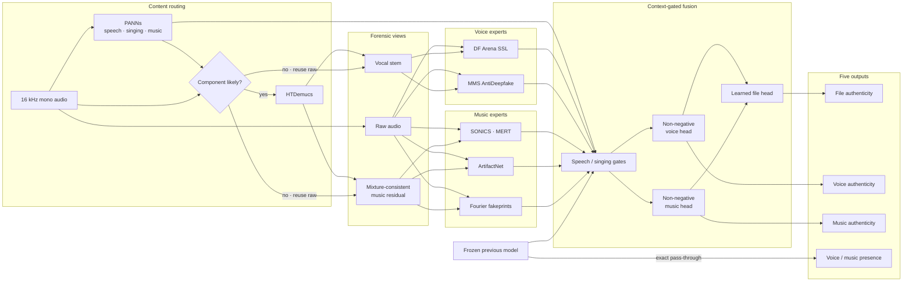

<div align="center">

# Multi-Component Audio Deepfake Detection

### Component-aware forensic ensemble for speech, singing, and music

[](https://www.python.org/)
[](https://pytorch.org/)
[](docs/METHODOLOGY.md)

음성·노래·반주가 혼재된 오디오에서 **파일 전체의 진위**, **음성 성분의 진위**,
**음악 성분의 진위**를 함께 추정하는 오디오 포렌식 파이프라인입니다.

</div>

> 본 모델은 **행정안전부·한국지능정보사회진흥원 주최**, **국립과학수사연구원 주관**의 오디오 딥페이크 탐지 AI 경진대회에서 개발했습니다. 이 저장소는 제출 파일이나 학습 음원을 배포하지 않고, 모델 설계와 검증 방법 및 핵심 구현을 정리한 연구용 코드 릴리스입니다.

## Overview

혼합 오디오의 진위 판별에는 두 종류의 불확실성이 동시에 존재합니다. 파일에 음성과 음악 중 무엇이 들어 있는지 알아야 하고, 존재하는 각 성분이 실제인지 생성된 것인지도 구분해야 합니다. 하나의 classifier가 다섯 출력을 한 번에 결정하도록 두는 대신, 이 프로젝트는 문제를 다음 세 단계로 분해합니다.

1. **Content routing** — PANNs로 speech, singing, music 문맥과 성분 존재 단서를 추정합니다.
2. **Component forensics** — 원본과 HTDemucs 보컬·반주 stem을 음성/음악 전문 detector로 분석합니다.
3. **Context-gated fusion** — 말하기와 노래하기 문맥에 따라 전문가의 기여도를 다르게 결합합니다.

최종 시스템은 이전 모델의 높은 성분 존재 성능을 보존하기 위해 두 presence 출력을 그대로 통과시키고, 세 authenticity 출력만 다시 학습합니다. 모든 추론은 파일별로 독립적이며 평가 파일 사이의 순위, 평균, 분위수 또는 예측 분포를 공유하지 않습니다.

## Key contributions

- **Component-aware ensemble** — 원본, 분리 보컬, 혼합 일관성 반주를 서로 다른 관측으로 사용합니다.
- **Hybrid evidence** — 대규모 self-supervised representation과 잔차·주파수 기반 forensic signal을 함께 사용합니다.
- **Semantic context gating** — speech/singing 문맥에서 각 전문가의 계수를 분리해 학습합니다.
- **Robust codec training** — MP3, AAC, G.711 변형을 포함하되 동일 부모의 파생 view가 학습 비중을 과도하게 키우지 않도록 가중치를 공유합니다.
- **Conservative model selection** — 평균 EER과 신뢰 가능한 하위집단의 tail risk를 함께 평가합니다.
- **Frozen presence contract** — authenticity 개선이 presence 출력을 변경하지 않도록 코드와 테스트에서 보장합니다.

## Architecture



### Model stack

| Stage | Model / method | Function in this system |
|---|---|---|
| Semantic routing | PANNs Cnn14 | Speech/singing context와 조건부 분리 실행 신호 |
| Source separation | HTDemucs | 보컬과 반주 관측 생성; `music = mixture - vocal`로 혼합 일관성 유지 |
| Voice forensics | DF Arena 1B, MMS-300M AntiDeepfake | 원본·보컬의 음성 합성 흔적 탐지 |
| Music representation | SONICS SpecTTTra, MERT-v1-95M | 장기 음악 문맥과 동결 다층 음악 표현 |
| Music forensics | ArtifactNet, Fourier fakeprints | HPSS 잔차와 deconvolution 주파수 artifact 탐지 |
| Fusion | Constrained logistic heads | Train-only 정규화, 비음수 계수, 문맥별 가중치 |

## Research foundations and extensions

이 파이프라인은 공개 모델을 단순히 평균하지 않습니다. 각 연구가 포착하는 증거의 종류를 분리하고, 대회의 다성분 출력 구조에 맞춰 확장했습니다.

| Research foundation | Original idea | Extension in this project |
|---|---|---|
| [HTDemucs](https://arxiv.org/abs/2211.08553) | 파형·스펙트럼을 함께 사용하는 음악 source separation | 분리 결과를 최종 예측이 아닌 추가 forensic view로 사용하고, 학습 장면에도 동일한 분리 왜곡을 적용 |
| [PANNs](https://arxiv.org/abs/1912.10211) | AudioSet 기반 범용 audio tagging | 진위 classifier 대신 semantic router와 context gate로 사용 |
| [Post-training for Deepfake Speech Detection](https://arxiv.org/abs/2506.21090) | 다국어 SSL encoder를 대규모 artifact 음성으로 사후학습 | 원본·vocal stem을 함께 평가하고 손실이 관측된 FP16 변환 대신 FP32 detection path 보존 |
| [SONICS](https://arxiv.org/abs/2408.14080) | End-to-end 생성곡과 장기 시간 의존성 모델링 | 원본과 반주 branch를 함께 사용하고 혼합 음성 간섭 조건으로 detector를 보정 |
| [MERT](https://arxiv.org/abs/2306.00107) | 음향·음악 교사를 이용한 self-supervised music representation | 95M encoder를 동결하고 다층 표현 위의 작은 authenticity head만 학습 |
| [ArtifactNet](https://arxiv.org/abs/2604.16254) | HPSS 기반 다채널 residual forensic detector | HPSS의 정확한 `0/0`만 수치적으로 정의하고 원래 유효한 경로와 학습 파라미터는 그대로 유지 |
| [Fourier fakeprints](https://arxiv.org/abs/2506.19108) | 생성기의 deconvolution이 남기는 주기적 spectral peak | Minimum-filter와 quadratic lower-envelope를 별도 특징으로 유지해 융합기가 조건별 유효성을 선택 |

[SONAR](https://arxiv.org/abs/2511.21325)의 spectral-residual voice detector도 독립 변환과 수치 검증까지 수행했지만, 동일한 선택 프로토콜에서 최종 조합의 목적함수를 개선하지 못해 제외했습니다. 논문 성능이나 모델 크기보다 현재 데이터에서의 상보성과 재현성을 우선했습니다.

방법론의 세부 수식, 제외한 후보, 데이터 구성은 [Methodology](docs/METHODOLOGY.md)와 [References](docs/REFERENCES.md)에 정리했습니다.

## Context-gated fusion

각 전문가 점수 `x`를 PANNs 문맥 비율로 두 항으로 나눕니다.

```text
x_ordinary = x × (1 - context)
x_context  = x × context
```

Voice head는 singing context를, Music head는 speech context를 사용합니다. Head의 계수는 음수가 될 수 없으며 이전 모델의 계수는 별도 상한과 더 강한 L2 penalty를 적용합니다. 이를 통해 새로운 전문가가 실제 추가 증거로 작동하도록 하고, 기존 점수는 제한된 anchor로 남깁니다.

File head는 성분 존재와 진위를 결합한 noisy-or 값을 포함합니다.

```text
union = 1 - (1 - voice_presence × voice_fake)
            (1 - music_presence × music_fake)

file_features = [
    logit(union),
    voice_presence × logit(voice_fake),
    music_presence × logit(music_fake),
    previous_file_logit,
]
```

최종 설정은 component temperature `2.0`, Voice/Music/File regularization `0.03 / 0.003 / 0.03`을 사용합니다. Voice 출력은 개발 하위집단의 회귀를 줄이기 위해 새 head와 이전 head를 `50:50`으로 축소 혼합합니다.

## Training and selection

### Data protocol

- MLAAD-tiny, FakeMusicCaps, SONICS, FMA, AIME, VocalSet의 라이선스가 확인된 subset 사용
- 원 발화, prompt, singer, artist 단위의 group-disjoint split
- Voice/Music의 real-fake 조합, 단일 성분, 순차 등장, 상대 음량 및 채널 변형으로 controlled mixture 구성
- 선택 원본과 전처리 사본을 함께 계산한 보수적 용량: **4,906,853,896 bytes**
- 학습 음원, 평가 음원, 외부 checkpoint는 이 저장소에서 재배포하지 않음

### Codec robustness

Train 320개와 development 160개 부모 장면에 MP3 32 kbps, AAC 32 kbps, G.711 μ-law 8 kHz view를 메모리에서 생성했습니다. Clean sample과 세 codec view는 부모 하나의 총 가중치를 공유합니다.

### Candidate search

```text
10 expert configurations
× 2 training cohorts (clean / codec)
× 24 fusion variants
= 480 candidates
```

후보 선택은 주요 집단 EER의 평균과 신뢰 가능한 하위집단 EER의 90백분위를 같은 비중으로 결합합니다. Real/Fake 중 한 클래스라도 10개 미만인 집단은 진단에는 남기되 모델 선택에서는 제외합니다.

```text
component_error = 0.5 × mean(major-group EER)
                + 0.5 × p90(reliable subgroup EER)

selection_error = 0.5 × file_error
                + 0.2 × voice_error
                + 0.3 × music_error
```

## Validation summary

동일한 외부 development cohort 1,341행에서 비교한 모델 선택용 proxy입니다. 480개 후보와 추가 5개 voice 혼합률을 같은 development set에서 비교했으므로, 새로운 독립 holdout 성능이나 비공개 평가 점수로 해석할 수 없습니다.

| Robust error ↓ | Previous system | Final system | Δ |
|---|---:|---:|---:|
| Weighted authenticity proxy | 0.126204 | **0.113931** | -0.012273 |
| File | 0.123524 | **0.113109** | -0.010415 |
| Voice | 0.152037 | **0.134259** | -0.017778 |
| Music | 0.113447 | **0.101748** | -0.011699 |

### Runtime verification

| Check | Result |
|---|---:|
| Presence outputs | 16개 실제 파형에서 이전 경로와 bit-exact |
| Input-order sensitivity | 역순 실행 최대 차이 `0` |
| Peak GPU memory | 8.204 GiB on NVIDIA L4 |
| Peak process-tree RAM | 5.194 GB |
| Projected 1,200-file runtime | 36.859 min |

처리 시간은 세 개의 60초 입력 실측값 중 최댓값으로 계산한 보수적 외삽이며, 비공개 전체 평가 세트의 실측 시간이 아닙니다. 전체 결과와 실패한 하위집단은 [Experiments](docs/EXPERIMENTS.md)에 공개했습니다.

## Repository layout

```text
.
├── configs/
│   └── final_strategy.yaml       # Frozen strategy and search space
├── docs/
│   ├── EXPERIMENTS.md            # Results, regressions, runtime checks
│   ├── METHODOLOGY.md            # Training and inference details
│   ├── REFERENCES.md             # Papers, repositories, datasets
│   └── REPRODUCIBILITY.md        # Assets, revisions, invariants
├── results/
│   └── summary.json              # Machine-readable public metrics
├── src/
│   ├── codec_views.py            # Deterministic codec transforms
│   ├── fourier_detector.py       # Interpretable spectral fakeprints
│   ├── fusion.py                 # Context gates and presence freeze
│   ├── pipeline.py               # File-independent inference flow
│   └── selection.py              # Constrained fitting and robust objective
└── tests/
    └── test_core.py              # Core numerical invariants
```

## Quick start

무거운 checkpoint 없이 fusion과 검증 로직을 확인할 수 있습니다.

```bash
git clone https://github.com/choi0312/multicomponent-audio-deepfake-detection.git
cd multicomponent-audio-deepfake-detection

python -m venv .venv
source .venv/bin/activate
pip install -r requirements.txt
pytest -q
```

전체 추론에는 사전학습 모델과 제공 baseline 자산이 필요합니다. 필요한 revision, 라이선스, feature schema는 [Reproducibility](docs/REPRODUCIBILITY.md)를 참고하십시오.

## Scope and limitations

- 이 릴리스는 핵심 방법론과 weight-free reference code를 제공하며, 제출 checkpoint의 재배포본이 아닙니다.
- 반복적인 development-set 탐색으로 인한 선택 편향이 있습니다.
- Codec development 480행은 160개 clean 부모에서 파생됐습니다.
- 일부 singing voice 라벨은 source identity와 PANNs filtering에 의존하는 약한 라벨입니다.
- 보컬+가짜 반주 Voice, MP3 Voice/Music, 채널 변형 Music 등 일부 하위집단은 악화됐습니다.
- 공개된 proxy 개선은 실제 운영 환경이나 비공개 평가에서의 성능을 보장하지 않습니다.

## License and attribution

ArtifactNet, AntiDeepfake, MERT 등 일부 외부 가중치에는 비상업 조건이 적용됩니다. 이 저장소에는 해당 가중치와 학습 음원을 포함하지 않습니다. 사용 또는 재배포 전 [Third-party notices](THIRD_PARTY_NOTICES.md)와 각 upstream 라이선스를 확인하십시오.

프로젝트를 참고했다면 [CITATION.cff](CITATION.cff)와 함께 실제 사용한 원 논문 및 모델을 각각 인용해 주세요.
